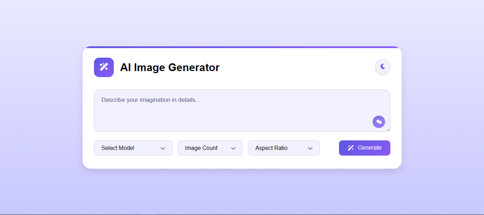
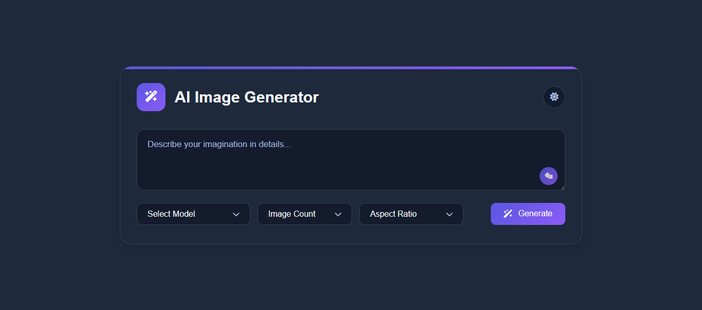
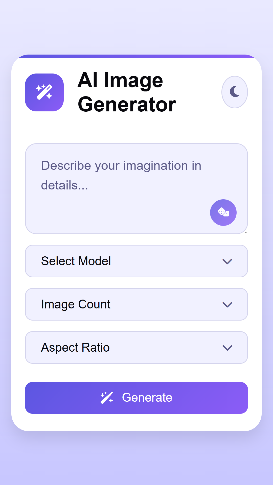

# AI Image Generator

A modern web application that generates images using various AI models through a clean and intuitive interface. Users can create images from text descriptions with different aspect ratios and model options.

![AI Image Generator Screenshot]

## Screenshots

### Light Theme


### Dark Theme


### Mobile View


## Features

- 🎨 Support for multiple AI models including:
  - FLUX.1-dev
  - Stable Diffusion v1.4/v1.5/v2.1/v3/XL
  - OpenJourney
  - FLUX.1-schnell
- 🖼️ Multiple aspect ratio options (1:1, 16:9, 9:16)
- 🎲 Random prompt suggestions
- 🌓 Dark/Light theme with system preference detection
- 📱 Responsive design for all devices
- 🔍 Image fullscreen view with zoom functionality
- ⬇️ Direct image download option
- 🎯 Generate multiple images simultaneously

## Technologies Used

- Frontend:
  - HTML5
  - CSS3
  - Vanilla JavaScript
- Backend:
  - Custom API endpoint (hosted on Render.com)
- Icons:
  - Font Awesome
- Fonts:
  - Inter (Google Fonts)

## Setup

1. Clone the repository:
```bash
git clone https://github.com/AadityaGeek/ai-image-generator.git
```

2. Update the `BACKEND_URL` in `script.js` to point to your API endpoint:
```javascript
const BACKEND_URL = 'your-backend-url';
```

3. Open `index.html` in your web browser or serve it through a local development server.

## Usage

1. Enter a detailed description of the image you want to generate in the text area
2. Select your preferred AI model from the dropdown menu
3. Choose the number of images to generate (1-4)
4. Select the desired aspect ratio
5. Click "Generate" and wait for your images
6. View images in fullscreen, zoom in/out, or download them directly

## Features in Detail

### Image Generation
- Supports multiple AI models for different styling options
- Adjustable aspect ratios for various use cases
- Multiple image generation in a single request

### User Interface
- Clean and modern design
- Dark/Light theme toggle
- Loading states with spinners
- Error handling with visual feedback
- Responsive gallery grid layout

### Image Interaction
- Fullscreen view mode
- Zoom functionality with mouse wheel
- Zoom level indicator
- Direct download capability
- Hover effects for interactive elements

## Contributing

Contributions are welcome! Please feel free to submit a Pull Request.

## License

This project is licensed under the MIT License - see the [LICENSE](LICENSE) file for details.

## Acknowledgments

- Font Awesome for the icons
- Google Fonts for the Inter font family
- [Add any other acknowledgments]

## Contact

- **GitHub**: [@AadityaGeek](https://github.com/AadityaGeek/)
- **Email**: `work.aadityakumar [at] gmail [dot] com`
- **LinkedIn**: [Aaditya Kumar](https://www.linkedin.com/in/aadityakr/)
- **Portfolio**: [Aaditya Kumar](https://aadityageek.github.io)

Feel free to reach out if you have any questions or suggestions!