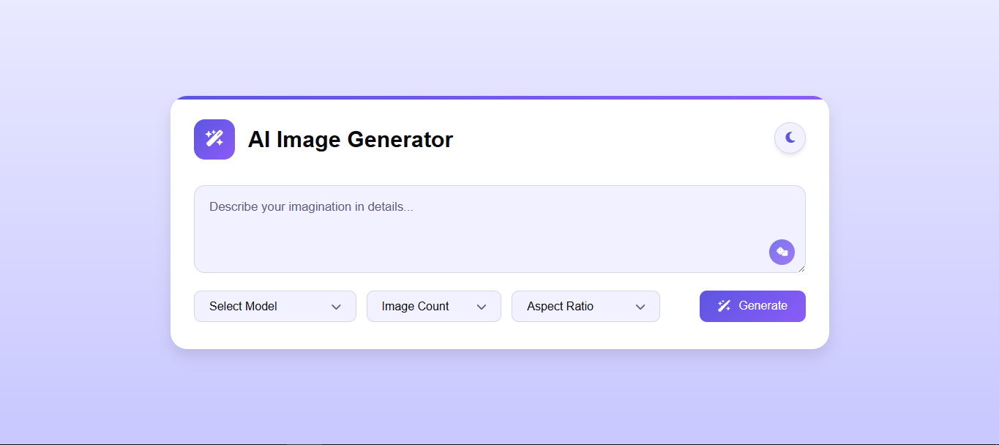
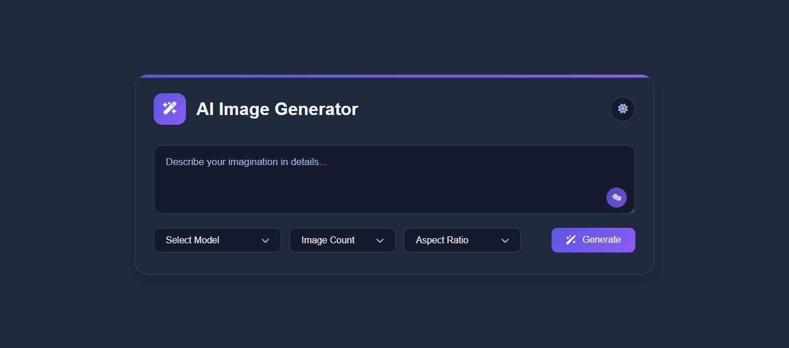
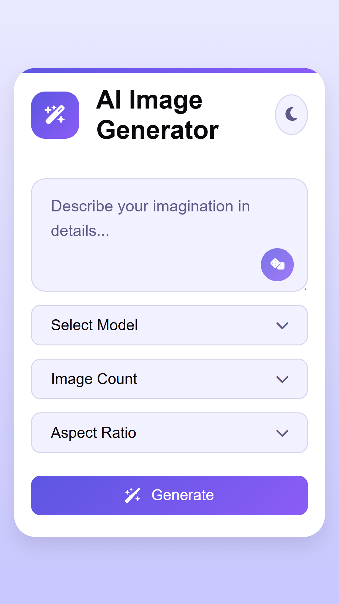

# AI Image Generator

A modern web application that generates images using various AI models through a clean and intuitive interface. Users can create images from text descriptions with different aspect ratios and model options.

## AI Image Generator Screenshots

### Light Theme



### Dark Theme



### Mobile View



## Features

- 🎨 Support for multiple AI models including:
  - FLUX.1 Schnell (High Quality & Detail)
  - Stable Diffusion 3 Medium (Hugging Face)
  - FLUX Photorealism (Cinematic & Realistic)
  - FLUX Anime (Manga & Japanese Anime)
  - FLUX 3D (3D Digital Art & CGI)
  - SDXL Turbo (Ultra-Fast Generation)
- 🖼️ Multiple aspect ratio options (1:1, 16:9, 9:16)
- 🎲 Random prompt suggestions
- 🌓 Dark/Light theme with system preference detection
- 📱 Responsive design for all devices
- 🔍 Image fullscreen view with zoom functionality
- ⬇️ Direct image download option
- 🎯 Generate multiple images simultaneously

## Technologies Used

- Frontend:
  - HTML5
  - CSS3
  - Vanilla JavaScript
- Backend:
  - Node.js & Express API (hosted on Render.com or locally)
  - Hugging Face Inference API / Multi-Model Engine
- Icons:
  - Font Awesome
- Fonts:
  - Inter (Google Fonts)

## Setup

1. Clone the repository:

```bash
git clone https://github.com/AadityaGeek/ai-image-generator.git
```

2. Install backend dependencies and configure environment:

```bash
cd backend
npm install
```

Create a `.env` file in the `backend/` directory:
```env
PORT=3000
HF_API_KEYS=your_huggingface_api_key_1,your_huggingface_api_key_2
```

3. Start the backend server:

```bash
npm start
```

4. Open `index.html` in your web browser or serve it through a local development server.

## Usage

1. Enter a detailed description of the image you want to generate in the text area
2. Select your preferred AI model from the dropdown menu
3. Choose the number of images to generate (1-4)
4. Select the desired aspect ratio
5. Click "Generate" and wait for your images
6. View images in fullscreen, zoom in/out, or download them directly

## Features in Detail

### Image Generation

- Generates images from text descriptions
- Supports multiple AI models for different styling options
- Adjustable aspect ratios for various use cases
- Multiple image generation in a single request

### User Interface

- Clean and modern design
- Dark/Light theme toggle
- Loading states with spinners
- Error handling with visual feedback
- Responsive gallery grid layout

### Image Interaction

- Fullscreen view mode
- Zoom functionality with mouse wheel
- Zoom level indicator
- Direct download capability
- Hover effects for interactive elements

## Contributing

Contributions are welcome! Please feel free to submit a Pull Request.

## License

This project is licensed under the MIT License - see the [LICENSE](LICENSE) file for details.

## Acknowledgments

- Font Awesome for the icons
- Google Fonts for the Inter font family

## Contact

- **GitHub**: [@AadityaGeek](https://github.com/AadityaGeek/)
- **Email**: `work.aadityakumar [at] gmail [dot] com`
- **LinkedIn**: [Aaditya Kumar](https://www.linkedin.com/in/aadityakr/)
- **Portfolio**: [Aaditya Kumar](https://aadityageek.github.io/)

Feel free to reach out if you have any questions or suggestions!
